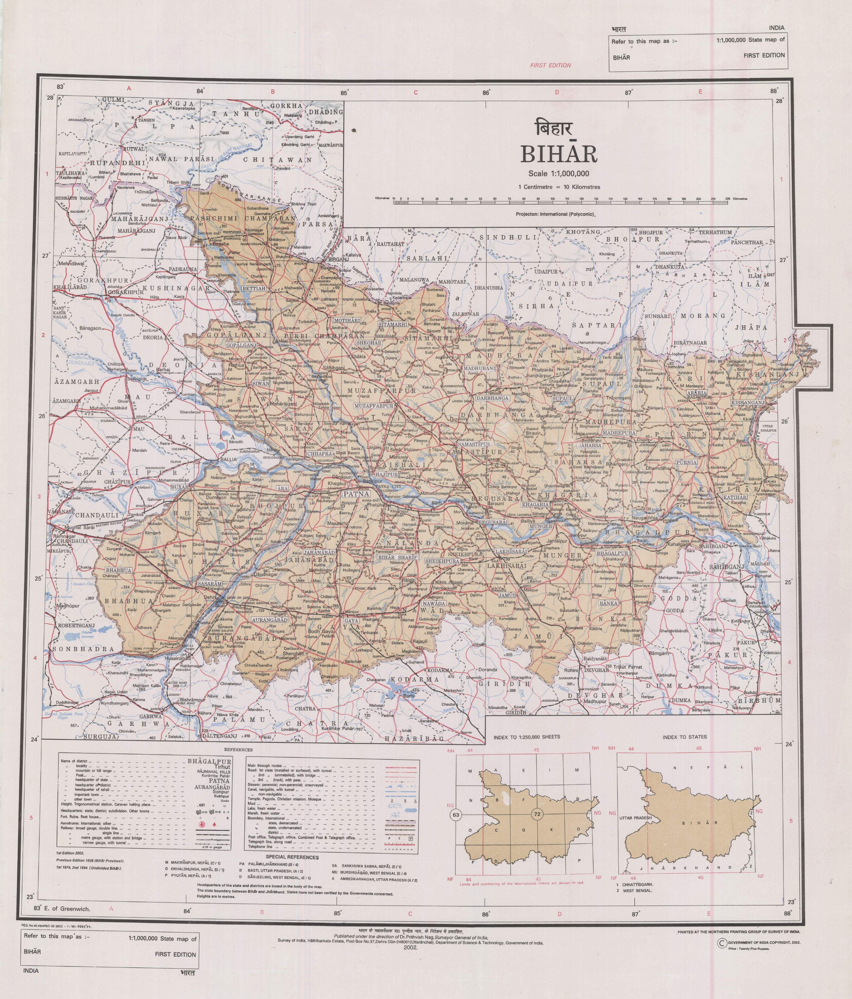

# Introduction

Bihar is a state in eastern India. It borders Uttar Pradesh to its west, Nepal to the north, the northern part of West Bengal to the east, and with Jharkhand to the south. The Bihar plain is split by the river Ganges, which flows from west to east.

In ancient and classical India, the area that is now Bihar was considered a centre of power, learning, and culture. From Magadha arose India's first empire, the Maurya empire, as well as one of the world's most widely adhered-to religions: Buddhism. Magadha empires, notably under the Maurya and Gupta dynasties, unified large parts of South Asia under a central rule. Another region of Bihar is Mithila which was an early centre of learning and the centre of the Videha kingdom.

Official Website of Bihar: [https://state.bihar.gov.in](https://state.bihar.gov.in)

## Profile & Statistics

| Key  | Value  |
|---------|---------|
| Founded | March 22, 1912 |
| Capital | Patna |
| Official Language | Hindi |
| Official Website | [https://state.bihar.gov.in](https://state.bihar.gov.in) |
| Area | 94,163 sq.km. |
| Time Zone | UTC+05:30 |
| Divisions | 9 |
| Districts | 38 ([View All](./Districts.md)) |
| Sub-Divisions | 101 |
| CD Blocks | 534 |
| Panchayats | 8406 |

## State Map

`State Map of Bihar`

<iframe src="https://www.google.com/maps/embed?pb=!1m18!1m12!1m3!1d1837570.4005406757!2d84.68113936122488!3d25.902216381344104!2m3!1f0!2f0!3f0!3m2!1i1024!2i768!4f13.1!3m3!1m2!1s0x39ed5844f0bb6903%3A0x57ad3fed1bbae325!2sBihar!5e0!3m2!1sen!2sin!4v1654418196912!5m2!1sen!2sin" width="100%" height="450" style="border:0;" allowfullscreen="" loading="lazy" referrerpolicy="no-referrer-when-downgrade"></iframe>
