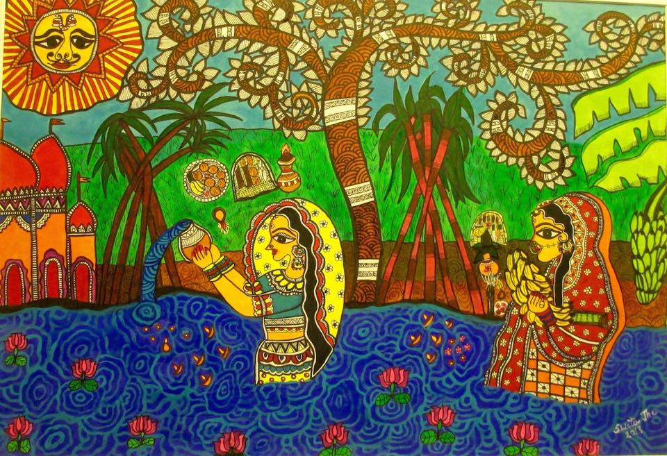

# Festivals of Bihar

Bihar has a tradition of festivals from time immemorial. Bihar as an ancient land has a long list of festivals and fairs which the people of Bihar actively take part in. the people of ancient Bihar worshipped the forces of nature, like serpents, stones, trees, Chaityas (funerary mounds) Yakshas (semi divine beings), etc. The most famous festival of Bihar is Chatth Puja. Festivals always break the monotony of day-to-day life and inspire us to promote love and brotherhood and to work for the upliftment of the society.

`Chhath Pooja is depicted in Madhubani Painting`

## Hindu Festivals (Month wise)

List of festivals celebrated in Bihar as per Hindu's Lunar months. Click on the Hindu month name to read full details about it.

- [Chaitra (March - April)](./chaitra/index.md)
- [Vaisakha (April - May)](./vaisakha/index.md)
- [Jyeshtha (May - June)](./jyeshtha/index.md)
- [Ashadha (June - July)](./ashadha/index.md)
- [Shraavana (July - August)](./shraavana/index.md)
- [Bhadra (August - September)](./bhadra/index.md)
- [Ashvin (September - October)](./ashvin/index.md)
- [Kartik (October - November)](./kartik/index.md)
- [Agahana (November - December)](./agahana/index.md)
- [Pausha (December - January)](./pausha/index.md)
- [Magha (January - February)](./magha/index.md)
- [Phalguna (February - March)](./phalguna/index.md)

&nbsp;

-----
> [!NOTE]
> We are working hard on this page to accurately document as much as possible. We will take some time to fully document all the festival of Bihar. 🙂
