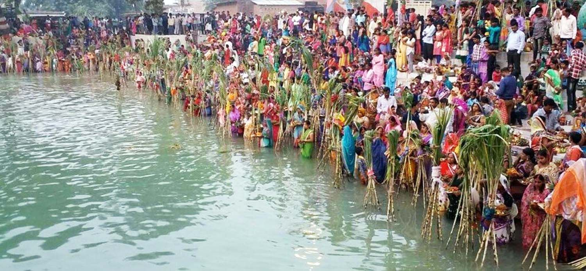

# Chhath

## Introduction

Chhath Pooja is an ancient Hindu festival historically native to the state of Bihar along with West Bengal, Uttar Pradesh, Jharkhand, and the southern parts of Nepal. Prayers during Chhath puja are dedicated to the solar deity, Surya, to show gratitude and thankfulness for bestowing the bounties of life on earth and to request that certain wishes be granted.

Chhathi Maiya, is the sixth form of Devi Parvati and Lord Surya's sister and is worshipped as the Goddess of the festival. It is celebrated six days after Diwali, on the sixth day of the lunar month of Kartika (October–November) in the Hindu calendar Vikram Samvat. The rituals are observed over four days. They include holy bathing (Nahaay Khaay), fasting and abstaining from drinking water (vrata) , standing in water, and offering prasad (prayer offerings) and arghya to the setting and rising sun. Some devotees also perform a prostration march as they head for the river banks. In Mithila during Chhaith, the Maithil men wear pure cotton dhoti without stitching to reflect the pure traditional culture of Mithilanchal.

`Chhath Pooja in Mithilanchal`

## Significance

As per legends, Chhath Puja stems from the early Vedic period, where sages would fast for days and perform the puja with mantras from Rigveda. It is believed that Chhath Puja was also performed by Karna, the son of Lord Surya and the king of Anga Desh, which is the modern-day Bhagalpur in Bihar. According to another legend, Pandavas and Draupadi also performed the Puja to overcome obstacles in their lives and reclaim their lost kingdom. For the people from Bihar and other close by areas, Chhath Puja is considered as Mahaparva.

## Rituals

The main worshippers, called parvaitin (from Sanskrit parv, meaning "occasion" or "festival"), are usually women. However, many men also observe this festival as Chhath is not a gender-specific festival. The parvaitin pray for the well-being of their family, and for the prosperity of their children.

In some communities, once a family member starts performing Chhath Puja, they are duty-bound to perform it every year and to pass it on to the following generations. The festival is skipped only if there is a death in the family that year. If the person stops performing the ritual on any particular year, it stops permanently and one cannot resume it. In other communities, this is not mandatory.

The prasad offerings include Thekua, Khajuria, Tikri and fruits (mainly sugar canes, sweet lime, banana and many seasonal fruits) offered in small bamboo baskets. The food is strictly vegetarian and is cooked without salt, onions or garlic. Emphasis is put on maintaining the purity of the food.

### Nahaay Khaay (Day 1)

This is the first day of Chhath Puja. The Parvaitin must take a holy bath, after which the entire house, its surroundings and pathways to the Ghat are thoroughly cleaned. The Parvaitin usually cooks Satvik Kaduaa Bhaat (Bottle Gourd and Bengal Gram Lentil preparation with Arva Rice Bhaat) This preparation is served to the deity in the afternoon as Bhog. This initiates the parv and is the last meal of the Parvaitin during Chhath Puja. The food is then eaten to protect the mind from thoughts of vengeance.

### Kharna/Lohanda (Day 2)

Kharna is the second day of Chhath Puja. On this day, the devotees are not allowed to drink even a single drop of water. In the evening, they can eat gur ke kheer (Kheer made up of jaggery) called Rasiaav together with Roti.

### Sanjhka Aragh (Day 3)

This day is spent preparing the prasad (offerings) at home, often consisting of a bamboo basket (daala) decorated with fruits, Thekua and rice laddus. On the eve of this day, the entire household accompany the devotee to a riverbank, pond, or other large body of water to make the Arghya offerings to the setting sun. The occasion can in many ways resemble a carnival. Besides the devotees and their friends and family, numerous participants and onlookers are all willing to help and receive the blessings of the worshipper. At the time of arghya, Gangajol water is offered to Sun God and the Chhathi Maiya (Ranbay Maay) is worshipped with the prasad. After the worship of Sun God, Chhaith songs are sung in the night and the vrat katha is read.

After returning home the devotees perform the ritual of kosi bharai together with the other family members. They take 5 to 7 sugarcanes and tie them together to form a mandap and beneath the shade of that mandap, 12 to 24 Diya lamps are burnt and thekua and other seasonal fruits are offered. The same ritual is repeated the next morning between 3 am and 4 am, and afterward the devotees offer arghya or other offerings to the rising sun.

### Bhorka Aragh (Day 4)

Before sunrise on the last day of Chhath puja, the devotees have to go to the riverbank to offer an arghya to the rising sun. After this, the protection of the child and the peace and happiness of the entire family is sought from Chhatti Maiya(Ranbay Maay). After worship, devotees drink water and eat a little prasad in order to break one's fast. This is called Paran or Parana.