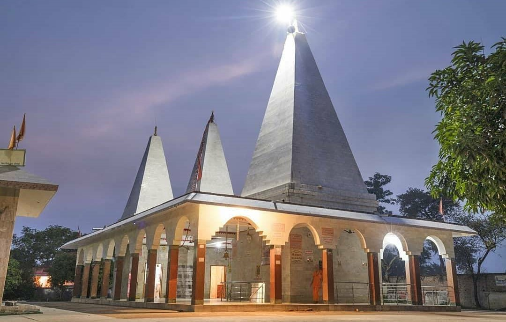

# Haleshwar Sthan

It is situated at 3km noth-west of Sitamarhi. As per ancient history, the king Videha had founded a temple of Lord shiva on the occasion of Putra Yeshti Yajna. His temple was named as Haleshwarnath temple.

This place is believed to be very ancient as the tale goes that Mithila king Janaka who was the father Sita from Ramayana built this Shiva temple. The stone Shivling at the sanctum is belived to be the original image through which the king invoked Lord Shiva.

The present temple is a recently built structure with a large ground around it for future development. There is provisions for the devotees accommodation inside the temple complex as lot of people visit this sacred place from far and wide. The devotees pour water carried from the river Bagmati or the Punoradham tank. A straight road connects the Punoradham temple with this temple.

`Haleswar Sthan`
